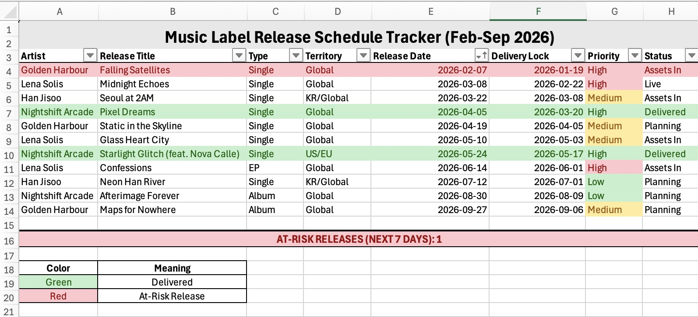
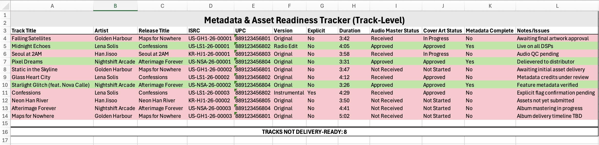
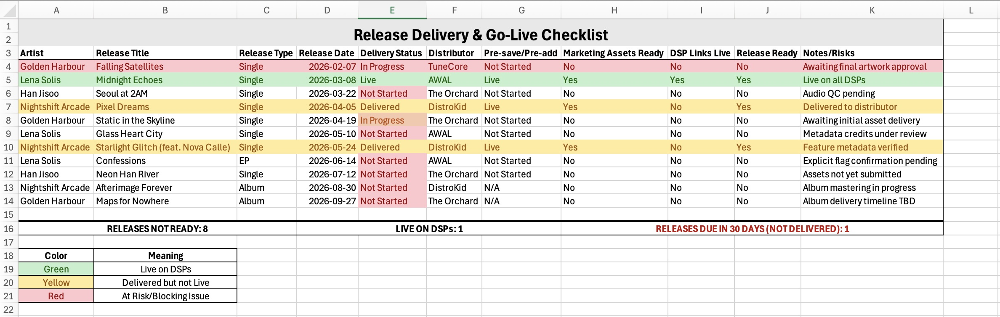

# Music Label Release Operations Tracker

## Overview
This project is an Excel-based release management tool designed to model real-world music label release workflows. It centralizes operational tracking across singles, EPs, and albums, helping teams monitor delivery status, asset readiness, and DSP go-live outcomes across multiple releases.

The tracker is built to surface risks early (e.g. upcoming releases not yet delivered) and provide a clear, at-a-glance view of release readiness for label, A&R, and operations teams.

[⬇️ Download the Excel Tracker](https://github.com/keelinmcloughlin/music-label-release-operations-tracker/raw/main/Music_Label_Release_Schedule_And_Delivery_Tracker.xlsx)

---

## What This Tracker Covers
- Distributor delivery status (Not Started / In Progress / Delivered / Live)
- Metadata and asset readiness
- Pre-save / pre-add status
- DSP go-live confirmation
- Multi-format releases (Singles, EPs, Albums)
- Upcoming releases due within 30 days
- At-risk releases requiring immediate attention

---

## Key Features
- **End-to-end release visibility** across distributors and formats  
- **Conditional formatting** to highlight:
  - Green: Delivered or Live on DSPs  
  - Red: At-risk releases (upcoming within 7 days and not delivered)
- **KPI summary metrics**, including:
  - Releases not ready
  - Live on DSPs
  - Releases due in the next 30 days but not delivered
- **Operational notes & risk tracking** for issues such as missing assets, metadata errors, or approval delays

---

## Preview: Conditional Formatting & KPIs

This tracker relies on Excel formulas and conditional formatting to surface release readiness and delivery risk at a glance.

Because GitHub does not render Excel formatting directly, screenshots are included below to illustrate the visual logic used in the workbook.

### Release Schedule

### Metadata and Assets

### Delivery and Checklist

---

## Tools Used
- Microsoft Excel  
  - Advanced formulas (COUNTIFS, IF, AND, date logic)
  - Conditional formatting
  - Data validation dropdowns
  - KPI summary calculations

---

## Use Case
This tracker is intended for use by:
- Music label operations teams
- A&R teams coordinating release timelines
- Release managers overseeing multi-format rollouts
- Analysts supporting release planning and risk management

It mirrors the types of operational dashboards used internally at labels to ensure releases move smoothly from delivery to live status across DSPs.

---

## Notes
- Artist names and release details are sample data for demonstration purposes.
- The structure is easily adaptable for real label catalogs or expanded team use.

---

## Author
**Keelin McLoughlin**  
